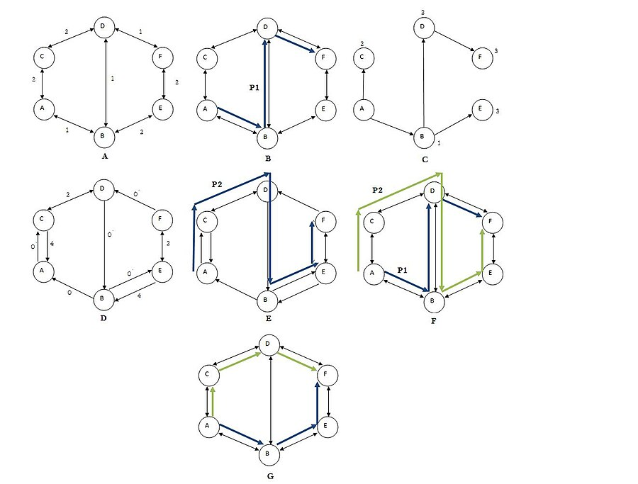

# Network disjointed paths calculator
## About
The **Network disjointed paths calculator** is an implementation of Suurbale's algorithm, that in a given non negatively-weighted directed graph, with recourse of Dijkstra's algorithm, finds the minimum weighted disjointed paths.\
For the networks, as a resource, the reference is [snd.lib](http://sndlib.zib.de/network), a data library for Survivable fixed telecommunication Network Design, for which I'm very thankful for all the hard work from the people of the Poznan University of Technology, mapping and maintaining this database for the purpose of research and optimization of telecommunication networks.\
This program is programmed with the *Two Step Aproach* and *Suurballe* algorithms, as with calculations for resolution rates between the two algorithms. For both of the algorithms, *Dijkstra's* method of calculation for the shortest path as been used.  

#### Requirements and set-up
Python 3.7+\
pip\

**NetworkX:** pip install networkx\
\

### .xml tree
This program is built for networks parsed via .xlm file, with the following tree:\

1. \<network xmlns="http://sndlib.zib.de/network" version="1.0"> 
	- \<networkStructure>
		- \<coordinatesType="type">
    			- \<node id="node_id">
			- \<coordinates>
             - \<x>x\</x>
             - \<y>y\</y>
          - \</coordinates>
         - \</node>
       - \<links>
         - \<link id="Link_id">
           - \<source>source_node</source>
           - \<target>target_node</target>
           - \<setupCost>cost</setupCost> 
         - \</link>
       - \</links>
     - \</networkStructure>
 - \</network>
Feel free to add any network of your choosing following this tree.
In the program folder there's already the following networks:\

1. *polska.xlm*
2. *france.xml*
3. *atlanta.xml*
4. *newyork.xml*

There's also a test network, with the architecture as follows:\

### Program architecture
#### Main function
Starts with a greeting and network selection, this input will then read the network with the function **xml_read**, or quit if that's the provided input.\
After the network selection, the program asks the user for the starting node as an input, checks it with the function **node_checker**, promptly asking for the destination node, using the same function for checking its existence. (*Beware that this input is case sensitive.*)\
A third menu appears, now for the functionality input, the options being calculating the shortest path with TSA (*Two-step approach*), using the Suurballe algorithm for the same finality, or a calculation of the resolution rates of all paths using both algorithms. The functions used are **TSA**, **Suurballe** and **res_rate**, respectively.

#### Functions
List of used functions:\
**test_graph1**: The test graph is not saved as an *.xml* file, but in this function, so it was easier to change it for testing purposes.\
\
**xml_read**: This function is the *.xml* file reader.\
\
**node_checker**: After the graph (nodes and edges) are read, this function will check if the existence of the chosen nodes.\
\
**TSA**: Using the **NetworkX** Dijkstra's functions, this function calculates the two-step approach algorithm, returning the two shortest disjointed paths, if there are any. It applies the Dijkstra algorithm without restrains and after the initial solution, it applies it again, but now against the fist path's constraints. \
\
**Suurballe**: Using the **NetworkX** Dijkstra' functions, but unlike the TSA algorithm, is interactive in the way that if the first path doesn't lead to the existence of a second disjointed one, it revisits the first path to accommodate the disjointness of the second one, making it a dynamic algorithm.\
\
**res_rate**: This function serves the purpose of comparing the resolution rates of both algorithms for a given network.

### Contributions
For the purposes of contribution to this work, feel free to use it whatever you feel appropriated, referring the .xml file to add new networks, as well as adding the input in the main function, according to the already established method.
